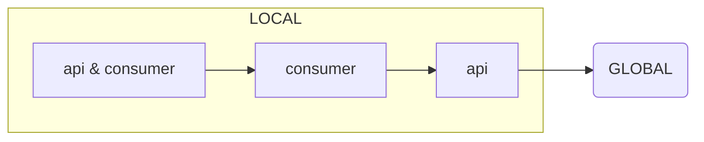
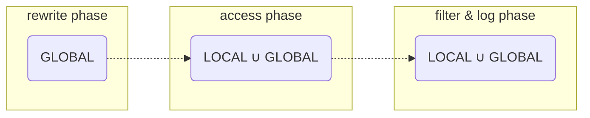
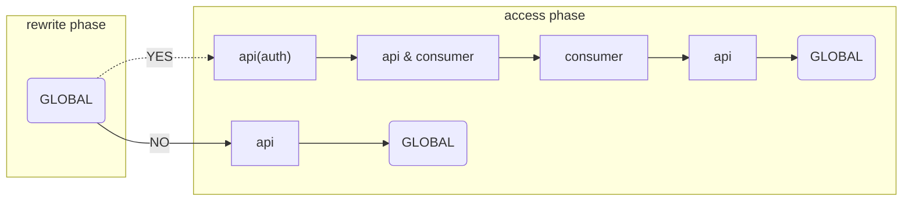
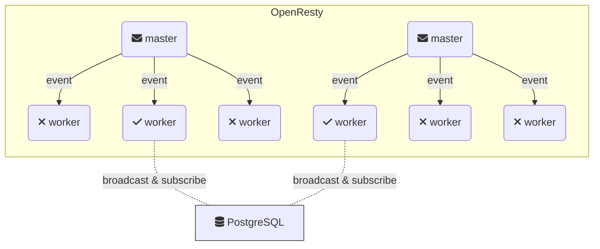
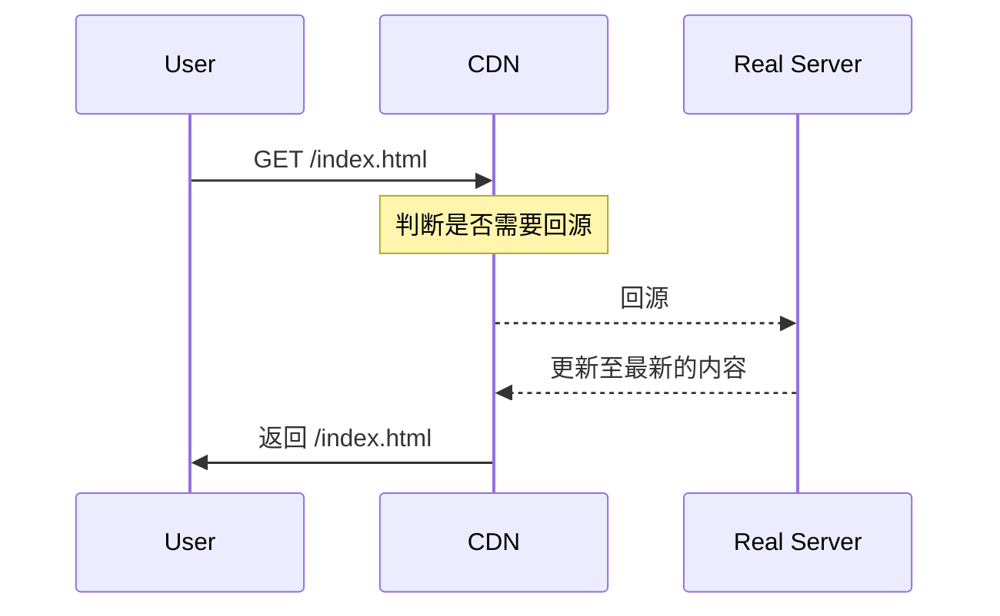

```mermaid
graph LR
    subgraph LOCAL
    A[api & consumer] --> B[consumer]
    B --> C[api]
    end
    C --> D(GLOBAL)
```

```mermaid
graph LR
    A -.-> B
    subgraph rewrite phase
    A(GLOBAL)
    end
    B -.-> C
    subgraph access phase
    B("LOCAL ∪ GLOBAL")
    end
    subgraph filter & log phase
    C("LOCAL ∪ GLOBAL")
    end
```

```mermaid
graph LR
    A -. YES .-> B
    A -- NO --> H
    subgraph rewrite phase
    A(GLOBAL)
    end
    subgraph access phase
    B["api(auth)"] --> C["api & consumer"]
    H[api] --> I(GLOBAL)
    C --> D[consumer]
    D --> F[api]
    F --> G(GLOBAL)
    end
```

```mermaid
graph TB
    subgraph OpenResty
    A(fa:fa-envelope master) -- event --> B(fa:fa-times worker)
    A -- event --> C(fa:fa-check worker)
    A -- event --> D(fa:fa-times worker)
    end
    C -. broadcast & subscribe .- P
    G -. broadcast & subscribe .- P
    P[fa:fa-database PostgreSQL]
    subgraph OpenResty
    E(fa:fa-envelope master) -- event --> F(fa:fa-times worker)
    E -- event --> G(fa:fa-check worker)
    E -- event --> H(fa:fa-times worker)
    end
    classDef rect stroke:#333,stroke-width:1px
    class P rect
```

```mermaid
sequenceDiagram
    User->>CDN: GET /index.html
    Note over CDN: 判断是否需要回源
    CDN-->>Real Server: 回源
    Real Server-->>CDN: 更新至最新的内容
    CDN->>User: 返回 /index.html
```
