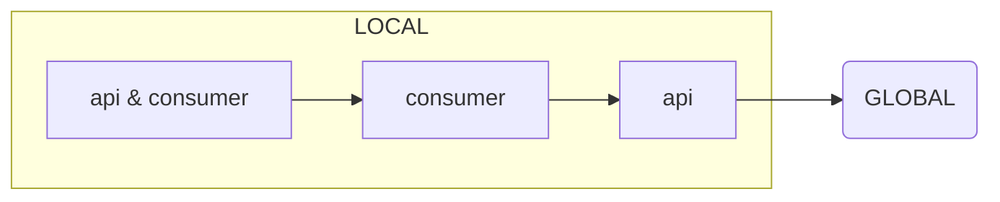
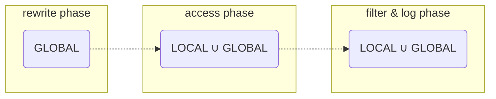
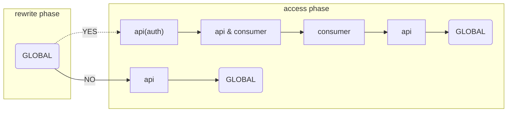

```mermaid
graph LR
    subgraph LOCAL
    A[api & consumer] --> B[consumer]
    B --> C[api]
    end
    C --> D(GLOBAL)
```

```mermaid
graph LR
    A -.-> B
    subgraph rewrite phase
    A(GLOBAL)
    end
    B -.-> C
    subgraph access phase
    B("LOCAL ∪ GLOBAL")
    end
    subgraph filter & log phase
    C("LOCAL ∪ GLOBAL")
    end
```

```mermaid
graph LR
    A -. YES .-> B
    A -- NO --> H
    subgraph rewrite phase
    A(GLOBAL)
    end
    subgraph access phase
    B["api(auth)"] --> C["api & consumer"]
    H[api] --> I(GLOBAL)
    C --> D[consumer]
    D --> F[api]
    F --> G(GLOBAL)
    end
```